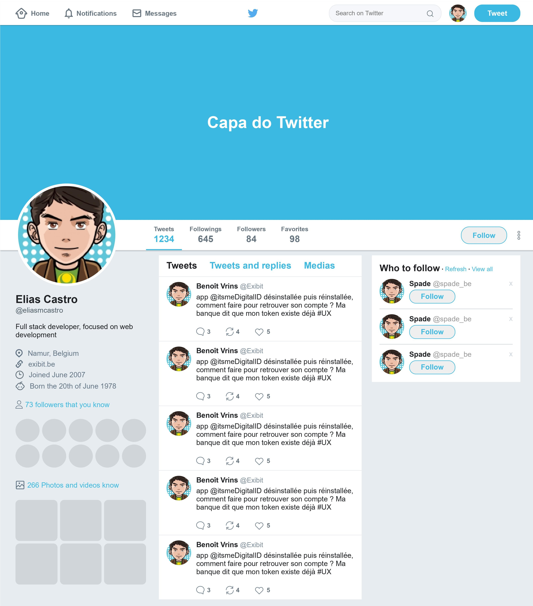

<h1 align="center">
  
</h1>

<h3 align="center">
  Flexbox
</h3>

Recriando a interface do Twitter utlizando os conceitos de Flexbox

  <a href="#como-executar-o-projeto">Como executar o projeto</a>

 

  

## Como executar o projeto

- Execute `git clone https://github.com/eliasmcastro/rocketseat-bootcamp-gostack-bonus-flexbox.git` para clonar este repositório
- Abra o arquivo index.html que está dentro da pasta no seu navegador de preferência para ver o resultado
